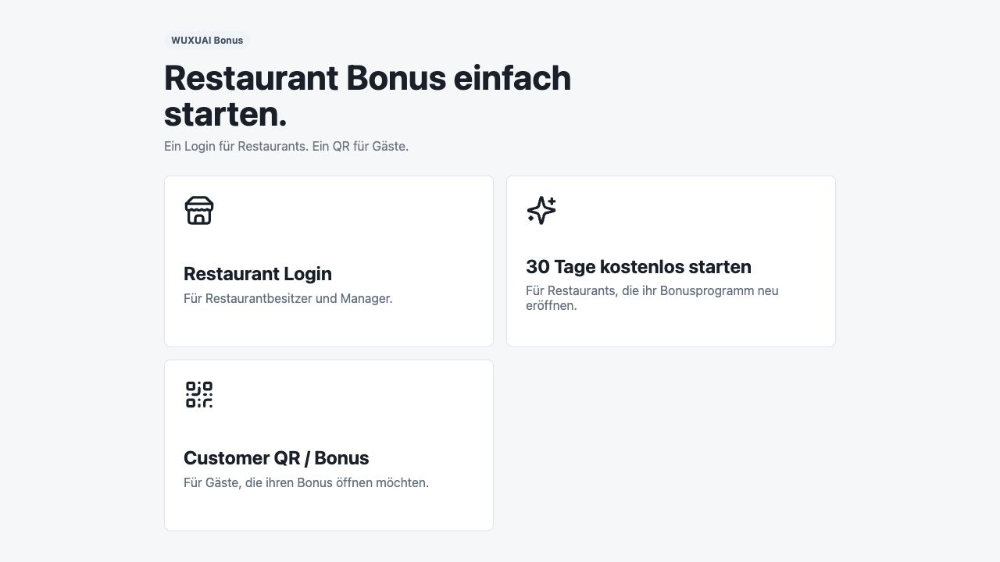
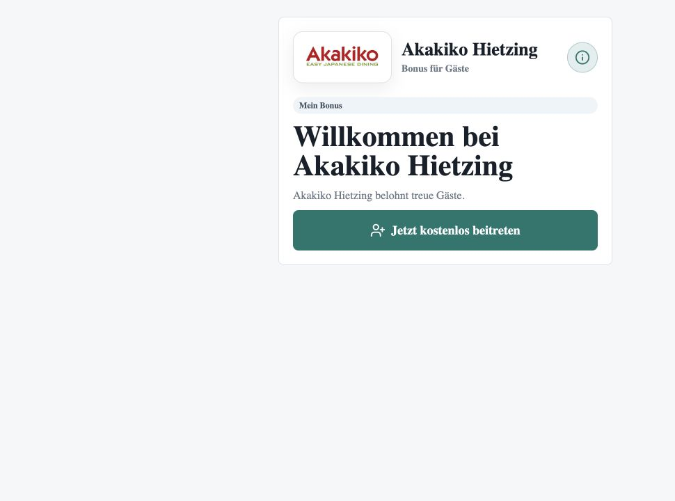
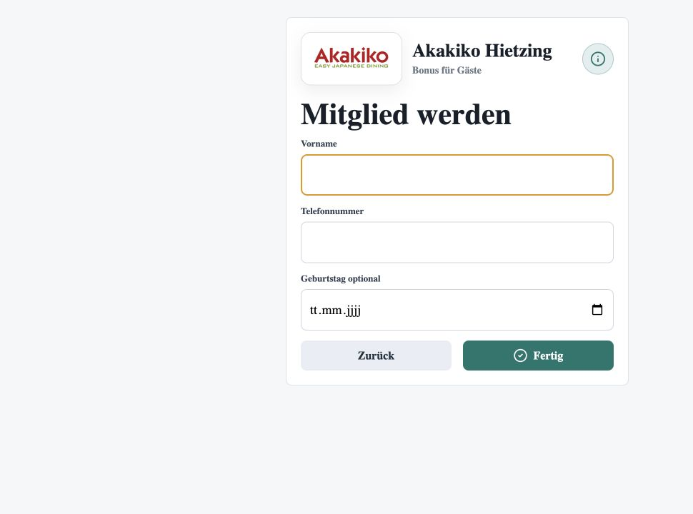
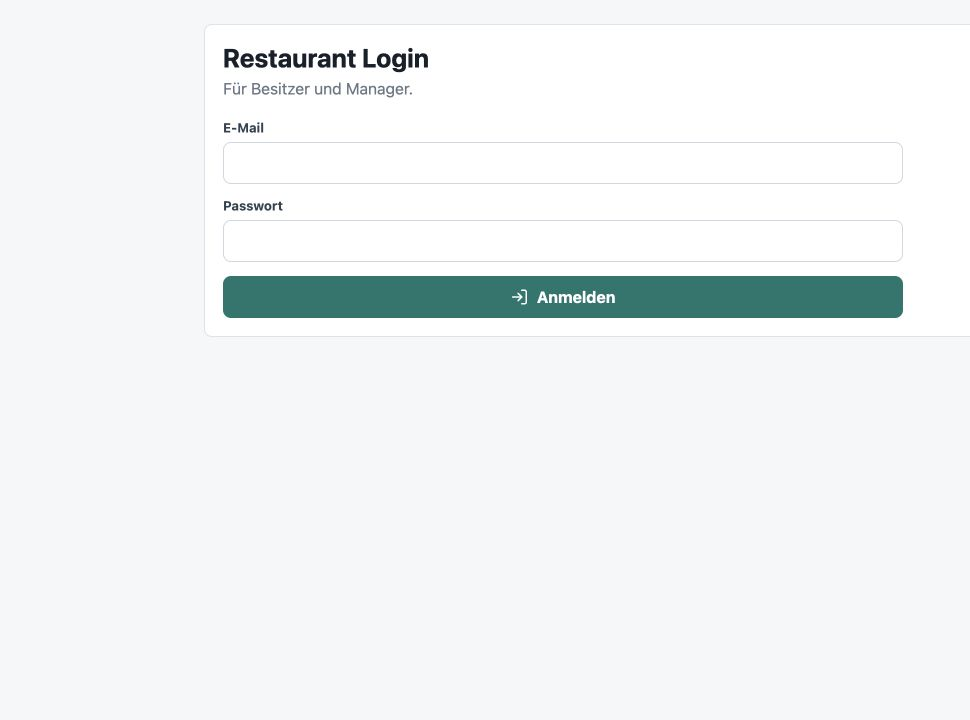
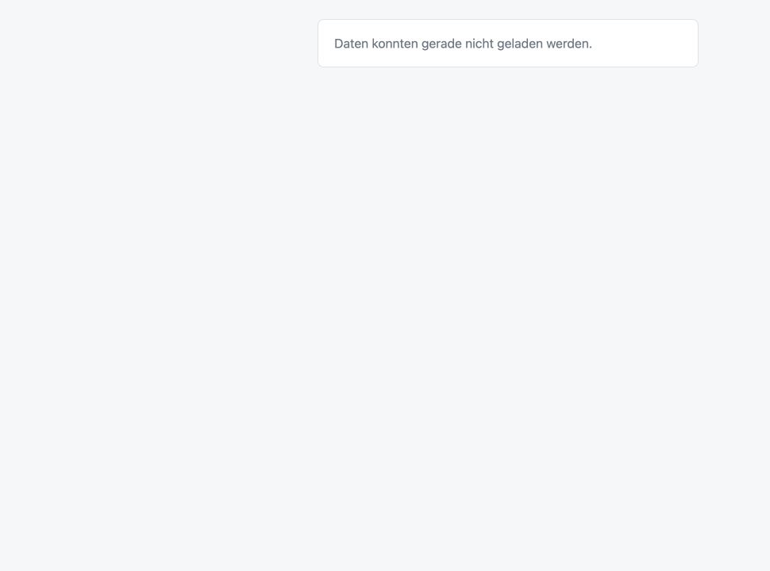
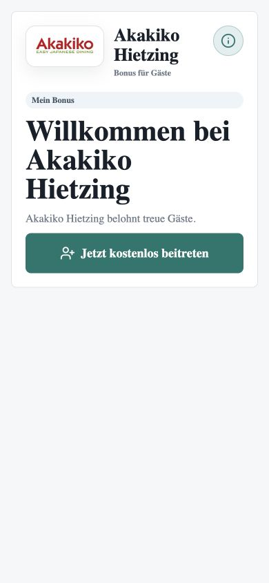

# WUXUAI Bonus V1 - App Bewertung, Bug- und Verbindungstest

Datum: 2026-07-13  
Status: **NOT READY**

## Auftrag

Die App wurde bewertet, sichtbare Bugs wurden gesucht, Verbindungsprobleme wurden geprüft und zentrale Workflows wurden lokal im Browser getestet.

Es wurden keine Produktlogik, keine Datenbank, keine RPCs und keine UI-Flows geändert.

## Gelesene Grundlage

- `AGENTS.md`
- `docs/00_START_HIER.md`
- `docs/04_RESTAURANT_PORTAL.md`
- `docs/05_CUSTOMER_PORTAL.md`
- `docs/06_STAFF_PORTAL.md`
- `docs/08_FLOW_01_ONBOARDING.md`
- `docs/09_FLOW_02_GAST_WERDEN.md`
- `docs/11_FLOW_04_PUNKTE_SAMMELN.md`
- `docs/13_SMART_REWARD_ENGINE.md`
- `docs/17_CTO_ENTSCHEIDUNGEN.md`
- `docs/18_CODEX_REGELN.md`
- `docs/19_CHANGELOG.md`

Zusätzlich wurden frühere NOT-READY-Berichte geprüft, besonders:

- `docs/reports/2026-07-11_V1_PILOT_NOT_READY_BLOCKER_ANALYSE_REPORT.md`
- `docs/reports/2026-07-11_TAGES_PIN_SECURITY_NOT_READY_GRUND_REPORT.md`
- `docs/reports/2026-07-12_PUNKTEEINLOESUNG_PROZENTLOGIK_DURCHGANG_REPORT.md`
- `docs/reports/2026-07-12_ONBOARDING_ACTIVE_STEP_RELOAD_FIX_REPORT.md`

## Gesamtbewertung

Die App ist lokal lauffähig und mehrere öffentliche Kernseiten laden stabil. Das Kundenportal lädt den echten Restaurantnamen für `akakiko-hietzing` und zeigt keinen `Kai Sushi`-Fallback.

Für einen Pilot-LOCK reicht der Stand aber nicht, weil kritische Staging-/Migrationsverbindungen weiterhin nicht bewiesen sind und eine doppelte Supabase-Migrationsversion vorliegt.

## Lokaler Browser-Test

Getestet mit lokalem Dev-Server:

```text
http://127.0.0.1:5173/
```

### 1. Öffentliche Startseite

Ergebnis: **lädt**

Screenshot:



Beobachtung:

- Startseite lädt auf Desktop und Mobile.
- Mobile 390 px hat keinen horizontalen Scroll.
- Sichtbarer englischer Text vorhanden: `Customer QR / Bonus`.

Bewertung:

**MITTEL** - V1 verlangt deutsche UI-Texte. Dieser Text muss später ersetzt werden.

### 2. Kundenportal mit echtem Restaurant-Slug

Getestet:

```text
/w/akakiko-hietzing
```

Ergebnis: **lädt echte Restaurantdaten**

Screenshot:



Beobachtung:

- Oben steht `Akakiko Hietzing`.
- Kein sichtbarer `Kai Sushi`-Fallback.
- Logo wird angezeigt.
- Info-Icon ist vorhanden.

Bewertung:

**OK lokal** - Slug-Auflösung funktioniert im geprüften öffentlichen Zustand.

### 3. Registrierung öffnen

Aktion:

`Jetzt kostenlos beitreten` geklickt.

Ergebnis: **Formular öffnet**

Screenshot:



Beobachtung:

- Formular ist Deutsch.
- Felder: Vorname, Telefonnummer, Geburtstag optional.
- Es wurde keine Testregistrierung abgeschickt, damit keine echten Supabase-Daten erzeugt werden.

Bewertung:

**Teilweise geprüft** - UI-Flow startet, aber Registrierung wurde nicht live gegen Staging validiert.

### 4. Admin-Route ohne Login

Getestet:

```text
/admin
```

Ergebnis: **Redirect zu Login**

Screenshot:



Bewertung:

**OK lokal** - Auth-Gate schützt den Admin-Bereich ohne Session.

### 5. Staff-Route ohne Login

Getestet:

```text
/staff/akakiko-hietzing
```

Ergebnis: **Redirect zu Login**

Screenshot:


Beobachtung:

- Staff-Route landet auf derselben Login-Seite mit Text `Restaurant Login` und `Für Besitzer und Manager.`
- Für Mitarbeiter wirkt das nicht wie ein klarer Staff-Arbeitsflow.

Bewertung:

**MITTEL** - Falls der Staff-Tablet-Flow im Pilot direkt genutzt werden soll, muss der Zugang mit echter Rolle/Session live geprüft werden.

### 6. Unbekannter Kundenportal-Slug

Getestet:

```text
/w/not-existing-restaurant
```

Ergebnis: **freundliche Fehleranzeige**

Screenshot:



Beobachtung:

- UI zeigt: `Daten konnten gerade nicht geladen werden.`
- Es wird kein Demo-Restaurant angezeigt.
- Console zeigt einen Fehler aus `CustomerPortal.tsx`, aber ohne sichtbare technische UI.

Bewertung:

**OK mit Hinweis** - Kein Demo-Fallback; Console-Logging kann später präziser werden.

### 7. Mobile Kundenportal

Getestet:

```text
390 x 844 px
```

Screenshot:



Beobachtung:

- Restaurantname und Logo sichtbar.
- Kein horizontaler Scroll.
- Button und Headline passen in die Karte.

Bewertung:

**OK lokal**.

## Kritische Bugs / Verbindungspunkte

### KRITISCH 1 - Doppelte Supabase-Migrationsversion

Gefunden:

```text
supabase/migrations/20260712001000_loyalty_redemption_return_rate.sql
supabase/migrations/20260712001000_welcome_gifts_status_update_fix.sql
```

Beide Migrationen verwenden dieselbe Versionsnummer:

```text
20260712001000
```

Risiko:

- Supabase Migrationen werden über diese Version identifiziert.
- Doppelte Versionen können `db push`, Staging-Sync oder Migrationshistorie blockieren.
- Eine Migration kann übersprungen oder als Konflikt behandelt werden.

Bewertung:

**KRITISCH** - muss vor Staging-Sync/Pilot bereinigt werden.

### KRITISCH 2 - Staging-Migrationen nicht final bewiesen

Aus den gelesenen Reports:

- `20260711006000_daily_pin_bruteforce_and_points_daily_limit.sql` wurde nicht gegen Staging bestätigt.
- `20260712001000_loyalty_redemption_return_rate.sql` wurde nicht gegen Staging bestätigt.
- mehrere kritische Live-Flows wurden nur lokal/statisch geprüft.

Bewertung:

**KRITISCH** - ohne Staging-Apply und Live-Test kein FINAL LOCK.

### KRITISCH 3 - Gesamtflow nicht live geprüft

Nicht vollständig live gegen Staging geprüft:

- echte Registrierung
- Willkommensgeschenk-Zuteilung
- erste Punktebuchung mit Tages-PIN
- Tages-PIN Brute-Force-Schutz
- Tageslimit Punkte sammeln
- Punkteeinlösung mit Punkteabzug
- Bonus Boost Aktivierung
- Dashboard-KPI-Abgleich
- RLS mit echten Rollen

Bewertung:

**KRITISCH** - der Pilotflow ist dadurch weiterhin NOT READY.

## Mittlere Bugs / Produktvertragskonflikte

### MITTEL 1 - Alter Kampagnen-/Coupon-Pfad in Setup-Checklist

Gefunden in:

```text
src/modules/onboarding/pilotOnboardingService.ts
```

Der Code prüft weiterhin:

- `coupons`
- `campaigns`
- `firstCampaignActive`
- `qrReady: activeCampaigns > 0`

Problem:

V1 hat Aktionen/Kampagnen aus dem Onboarding entfernt. QR-Bereitschaft darf nicht von aktiven Campaigns abhängen.

Bewertung:

**MITTEL bis KRITISCH**, falls `loadSetupChecklist` im aktiven Portalflow verwendet wird.

### MITTEL 2 - Dokumentationskonflikt bei Flow 04

`docs/11_FLOW_04_PUNKTE_SAMMELN.md` sagt:

```text
Der Gast gibt keinen freien Rechnungsbetrag ein.
Der Gast wählt einen Rechnungsbereich.
```

Der aktuelle Code in `CustomerPortal.tsx` zeigt aber:

```text
Rechnungsbetrag
z. B. 82,50 €
```

Der Code mappt den eingegebenen Betrag danach auf eine Stufe und sendet nur `amountTierKey` an `collect_bonus_points`.

Bewertung:

**MITTEL** - technisch plausibel, aber Bible und Code widersprechen sich. Vor LOCK muss die Produktregel eindeutig sein.

### MITTEL 3 - Englischer sichtbarer UI-Text

Gefunden:

```text
Customer QR / Bonus
```

Bewertung:

**MITTEL** - verletzt die V1-Regel `alle sichtbaren Texte Deutsch`.

### MITTEL 4 - Staff-Portal-Zugang nicht als Staff-Erlebnis sichtbar

`/staff/akakiko-hietzing` leitet ohne Session auf einen Besitzer-/Manager-Login.

Bewertung:

**MITTEL** - kann für den Pilot okay sein, wenn Staff-Accounts genutzt werden. Muss live mit Staff-Rolle geprüft werden.

## Kleine Punkte

### KLEIN 1 - React Router Future Warnings

Die Browser-Console zeigt React-Router-v7-Future-Warnings.

Bewertung:

**KLEIN** - kein V1-Blocker, aber Console-Rauschen.

### KLEIN 2 - Keine automatisierten Testskripte

`package.json` enthält:

```text
dev
build
preview
```

Kein automatisierter Test- oder Smoke-Test-Script.

Bewertung:

**MITTEL** für Pilotqualität, **KLEIN** für den aktuellen Audit-Scope.

## Workflow-Test Ergebnis

| Bereich | Ergebnis |
|---|---|
| Öffentliche Startseite | Lädt lokal |
| Kundenportal `/w/akakiko-hietzing` | Lädt echte Restaurantdaten |
| Registrierung öffnen | Formular öffnet |
| Registrierung abschicken | Nicht durchgeführt |
| Admin unauthenticated | Login-Gate aktiv |
| Staff unauthenticated | Login-Gate aktiv |
| Mobile öffentliche Seiten | Keine horizontale Scrollbar sichtbar |
| Punkte sammeln mit Tages-PIN | Nicht live getestet |
| Willkommensgeschenk | Nicht live getestet |
| Punkteeinlösung | Nicht live getestet |
| Bonus Boost | Nicht live getestet |
| Dashboard KPIs | Nicht live getestet |
| RLS/Security live | Nicht live getestet |

## Build Ergebnis

```text
npm run build
```

Ergebnis:

```text
erfolgreich
```

## Migration

Keine Migration erstellt.

Problem:

- doppelte lokale Migrationsversion `20260712001000`
- Staging-Anwendung mehrerer kritischer Migrationen nicht bestätigt

## RLS / Security

Nicht live geprüft.

Grund:

Dieser Audit hat keine Staging-Migrationen angewendet und keine echten anon/authenticated Supabase-Rollenabfragen ausgeführt.

## Offene Risiken

1. Doppelte Migration kann Staging-Sync blockieren.
2. Kritische Security-Migrationen sind nicht live bestätigt.
3. Pilot-E2E-Flow wurde nicht mit echten Staging-Testdaten ausgeführt.
4. Setup-Checklist enthält alte Campaign-/Coupon-Logik.
5. Bible und Code widersprechen sich beim Punkte-Sammeln-Eingabemodell.
6. Staff-Portal muss mit echter Staff-Rolle geprüft werden.

## Empfohlene Reihenfolge

1. Doppelte Migration sauber bereinigen, ohne bereits angewendete Historie zu zerstören.
2. Supabase Staging-Zugriff prüfen.
3. `npx supabase db push --include-all` erst nach Migrationsbereinigung ausführen.
4. Live-E2E-Test gegen Staging:
   - Registrierung
   - Willkommensgeschenk
   - Tages-PIN
   - Punkteeinlösung
   - Bonus Boost
   - Dashboard KPIs
   - RLS
5. Danach UI-Text `Customer QR / Bonus` eindeutschen.
6. Alte Campaign-/Coupon-Checklist entfernen oder nach V1-Regel ersetzen.

## Abschluss

- Aufgabe: App bewerten, Bugs suchen, Verbindungsproblem und Workflow testen
- Build: Ja
- Migration: Keine erstellt
- Flow-Test: Teilweise lokal, nicht live vollständig
- RLS/Security: Nein, nicht live geprüft
- Alte Logik geprüft: Teilweise, Campaign-/Coupon-Restlogik gefunden
- Status: **NOT READY**
